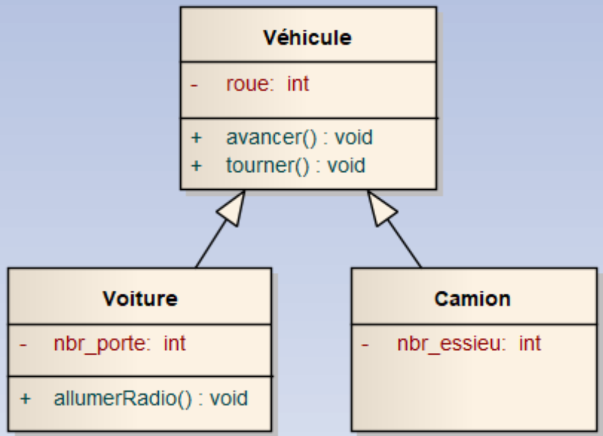

## Ex 1

Quelle est le comportement du programme ci-dessous ?

```cpp
#include <iostream>

using namespace std;

class C1 {
  public:
    
  protected:
    int val;
};

class C2 : public C1 {
  public:
    C2() { }
};

int main() {
    C2 c;
    c.val = 3;
}
```


# Ex 2
Quel est l'affichage du programme ci-dessous ?

```cpp
#include <iostream>

using namespace std;

class C1 {
  public:
    
  public:
    int val;
};

class C2 : public C1 {
  public:
    C2() { 
        val = 5;
    }
};

int main() {
    C2 c;
    cout << "Res=" << c.val;
}
```


## Ex 2

Quel est l'affichage du programme suivant ?

```C++
struct Parent{
    Parent(){
        cout << "Aff : A" << endl;
    }
    Parent(int a){
        cout << "Aff : B" << endl;
    }
};

struct Enfant : public Parent{
    Enfant(){
        cout << "Aff : C" << endl;
    }
    Enfant(int a){
        cout << "Aff : D" << endl;
    }
    Enfant(int a, int b) : Parent(a){
        cout << "Aff : E" << endl;
    }
    Enfant(double a) : Parent(a){
        cout << "Aff : F" << endl;
    }
};

int main(){
    cout << "Exercice 2" << endl;
    cout << "E1" << endl;
    Enfant e1;
    cout << "p1" << endl;
    Parent p1(12);
    cout << "E2" << endl;
    Enfant e2(1,2);
    cout << "E3" << endl;
    Enfant e3(5.3);
    cout << "E4" << endl;
    Enfant e4(2);
}
```

## Ex 3

Implémenter les classes `Vehicule` et `Voiture` de l'image suivante :



Le nombre de roue est affecté pendant la construction des classes enfants.

Dans les méthodes, il faut afficher un texte.

Vous devez pouvoir exécuter le main suivant 

```CPP
int main()
{
    cout << "Exercice 2" << endl << endl;
    Voiture v;
    v.avancer();
    v.tourner();
}
```
