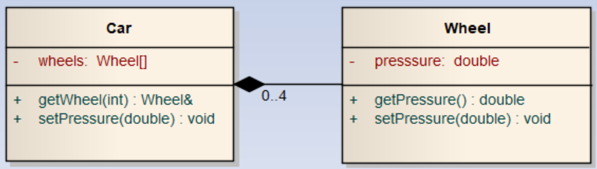

# Object

## Ex1

Créer un programme avec comme fichiers
- `main.cpp`
- `square.cpp`
- `square.h`

Implémenter une classe `Square` qui aura comme attributs privés :
- `double side_length`
- `double area`

Les méthodes :
- get area
- get side
- set side (en affectant une valeur à side, il faut aussi calcul l'air du carré)

Voici le code `main.cpp`, *ce code n'est pas complet*.

```CPP
#include <iostream>

int main(){
    cout << "Ex1 Objet Square" << endl;
    Square sq;
    sq.side_length = 3.4; // Cette ligne doit provoquer une erreur
    
    // Ici il faut mettre le côté de sq a 3.4;

    // Compléter l'affichage ci-dessous.
    cout << "Le côté vaut : " << ... << " et une aire de : " << ... << endl;
}
```
## Ex 2

Quel est l'affichage du problème suivant :

```CPP
    cout << endl << "Exercice 2 reference" << endl;
    Container c;
    c.getValRef().setValue(4);
    Value v1 = c.getVal();
    Value v2 = c.getVal();
    Value v3 = c.getValRef(); // Attention v3 n'est pas une reference
    Value& v4 = c.getValRef();

    int num = 1;

    cout << num << ") V1 : " << v1.getValue() << endl;
    cout << num << ") V2 : " << v2.getValue() << endl;
    cout << num << ") V3 : " << v3.getValue() << endl;
    cout << num << ") V4 : " << v4.getValue() << endl;
    cout << num << ") C : " << c.getVal().getValue() << endl << endl;

    num = 2;
    v1.setValue(6);
    cout << num << ") V1 : " << v1.getValue() << endl;
    cout << num << ") V2 : " << v2.getValue() << endl;
    cout << num << ") V3 : " << v3.getValue() << endl;
    cout << num << ") V4 : " << v4.getValue() << endl;
    cout << num << ") C : " << c.getVal().getValue() << endl << endl;

    num = 3;
    v3.setValue(3);
    cout << num << ") V1 : " << v1.getValue() << endl;
    cout << num << ") V2 : " << v2.getValue() << endl;
    cout << num << ") V3 : " << v3.getValue() << endl;
    cout << num << ") V4 : " << v4.getValue() << endl;
    cout << num << ") C : " << c.getVal().getValue() << endl << endl;

    num = 4;
    v4.setValue(5);
    cout << num << ") V1 : " << v1.getValue() << endl;
    cout << num << ") V2 : " << v2.getValue() << endl;
    cout << num << ") V3 : " << v3.getValue() << endl;
    cout << num << ") V4 : " << v4.getValue() << endl;
    cout << num << ") C : " << c.getVal().getValue() << endl << endl;
```

## Ex 3
Créer un programme avec comme fichier
- `main.cpp`
- `car.cpp`
- `car.h`

Implémenter les classes suivantes dans les fichiers `car`



Le nombre de roues est défini par un `#define`

**Car**
- getWheel: Retourne une reference sur la roue du tableau à la position `id`
- setPressure : Affecte la valeur passée en paramètre à toute les roues

La sortie du programme suivant doit être :
```CPP
Car c;
c.setPressure(2.3);
for (int i = 0; i < NBR_WHEEL; i++)
{
    cout << "Roue : " << i << " pression : " << c.get_wheel(i).getPressure() << endl;
}
```

```console
Roue : 0 pression : 2.3
Roue : 1 pression : 2.3
Roue : 2 pression : 2.3
Roue : 3 pression : 2.3
```

# Solutions
