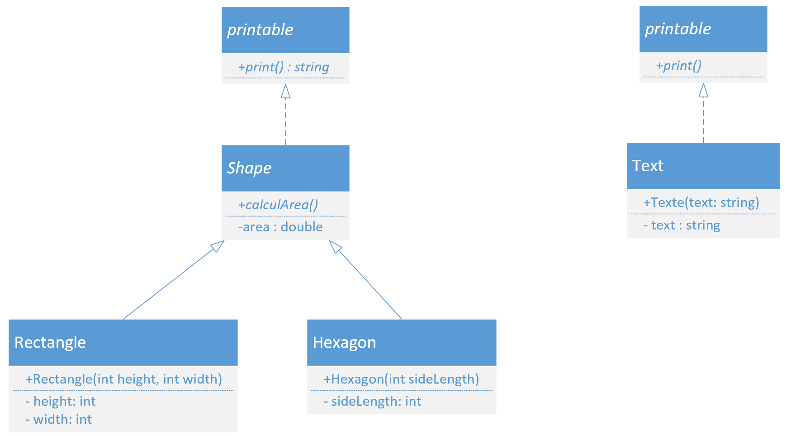

# Polymorphisme

## Ex 1
Quel est l'affichage du programme suivant :

```C
struct A{
    A() { cout << "Const A" << endl; }
    A(int a) : val(a) { cout << "Const A1 : " << val << endl; }
    
    void print(){ cout << "Val : " << val << endl; }
    void test1() { cout << "Test 1 A" << endl; }
    virtual void test2() { cout << "Test 2 A" << endl; }
    
    int val = 6;
};

struct B : public A{
    B(){ cout << "Constr B" << endl; }

    void test1() { cout << "Test 1 B" << endl; }
    void test2() override { cout << "Test 2 B" << endl; }
};

struct C : public A{
    C() :A(4) { cout << "Constr C" << endl; }

    void test2() override { cout << "Test 2 C" << endl; }    
};

struct D : public B{
    D(){ cout << "Constr D" << endl; }

    void test1() { cout << "Test 1 D" << endl; }
    void test2() override { cout << "Test 2 D" << endl; }    
};

struct E : public B{
    E(){ cout << "Constr E" << endl; }

    void test1() { cout << "Test 1 E" << endl; }
};

void funcTest(A& p){
    p.test1();
    p.test2();
}

void main()
{
    cout << "Constructeur A" << endl;
    A a;
    cout << "Constructeur B" << endl;
    B b;
    cout << "Constructeur C" << endl;
    C c;
    cout << "Constructeur D" << endl;
    D d;
    cout << "Constructeur E" << endl;
    E e;

    cout << "Call test 1" << endl;
    a.test1();
    b.test1();
    c.test1();
    d.test1();

    cout << "Call print E" << endl;
    e.print();
    cout << "Call print C" << endl;
    c.print();

    cout << "Call func test a" << endl;
    funcTest(a);
    cout << "Call func test b" << endl;
    funcTest(b);
    cout << "Call func test c" << endl;
    funcTest(c);
    cout << "Call func test d" << endl;
    funcTest(d);
    cout << "Call func test e" << endl;
    funcTest(e);

    cout << "Call ref 1c" << endl;
    A& r1 = c;
    r1.test1();
    r1.test2();

    cout << "Call ref 1e" << endl;
    A& r2 = e;
    r2.test1();
    r2.test2();
}
```


## Ex 2


#### Marche à suivre
- Implémenter le code qui correspond au diagramme ci-dessus.

#### Printable
print
: méthode virtuelle pure ( =0).

#### Shape
Comme cette classe a une méthode virtuelle, il faut aussi ajouter un destructeur virtuel. 

Destructeur
: Afficher `Shape est détruit`

calculArea
: Méthode virtuelle `pure`

On ne définit pas la méthode `print` dans cette classe

#### Rectangle et Hexagon
Les propriétés des formes sont initialisées lors de la construction des objets.

Destructeur
: Afficher `<forme> est détruit`

area
: calcul l'aire de la forme

print
: Retourne une chaîne de caractères avec le nom de la forme ainsi que l'aire, ex `Un rectangle avec une aire de : 12`

#### Text
Lors de la construction de la classe, on initialise la propriété `text`.

La propriété `text` est `const`

print
: retourne une chaîne de caractère : `Le message : <text>`

### Main
A la fin de l'implémentation, le code suivant doit pouvoir être exécuté dans le `main`

```cpp
void affichage(Printable& p){
    cout << "Le massage à afficher est : " << endl;
    p.print();
}

Shape* shapes[4] = {nullptr};
shapes[0] = new Rectangle(10,20);
shapes[1] = new Hexagon(3);

shapes[0]->calculArea();
shapes[1]->calculArea();

Text t("Bonjour");

affichage(*shapes[0]);
affichage(t);

delete shapes[0];
delete shapes[1];
delete t;
```

### Question
1. Quel est le rôle de la classe `Printable`
1. Est-ce qu'il est possible de créer une instance de type `Shape`
1. Est-ce qu'il est possible de créer une instance de type `Printable`
1. Est-ce que le `delete` d'un pointeur appel le destructeur de la classe.
1. Lors du `delete` du pointeur `shapes[0]` quel destructeur est appelé

## Ex 3
Quel est le danger du code suivant :

On reprend le code de l'exercice 2

```cpp
Rectangle* p1 = new Rectange(12,4);
Shape* p2 = p1;
delete p1;
```

# Solution

## Ex 1
```console
Constructeur A
Const A
Constructeur B
Const A
Constr B
Constructeur C
Const A1 : 4
Constr C
Constructeur D
Const A
Constr B
Constr D
Constructeur E
Const A
Constr B
Constr E
Call test 1
Test 1 A
Test 1 B
Test 1 A
Test 1 D
Call print E
Val : 6
Call print C
Val : 4
Call func test a
Test 1 A
Test 2 A
Call func test b
Test 1 A
Test 2 B
Call func test c
Test 1 A
Test 2 C
Call func test d
Test 1 A
Test 2 D
Call func test e
Test 1 A
Test 2 B
Call ref 1c
Test 1 A
Test 2 C
Call ref 1e
Test 1 A
Test 2 B
```
