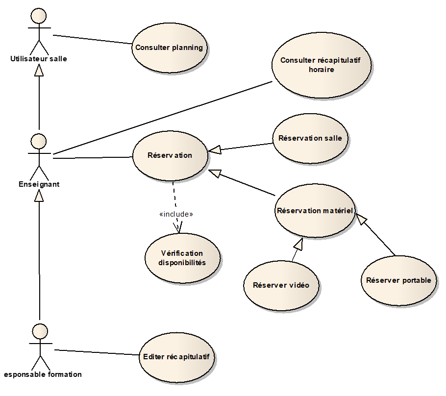
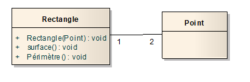
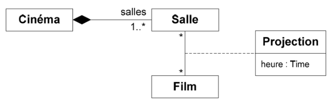
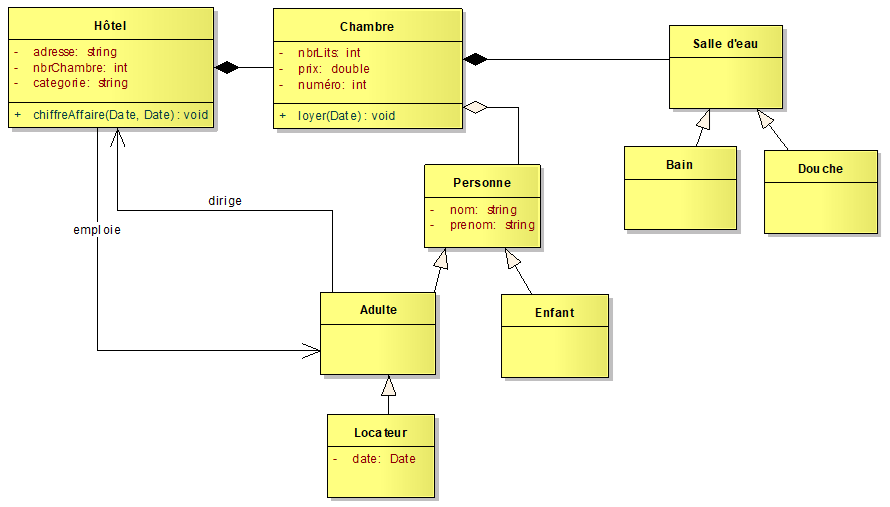

# UML

## Ex 1 - Use case

Dans un établissement scolaire, on désire gérer la réservation des salles de cours ainsi que du matériel pédagogique (ordinateur portable ou/et Vidéo projecteur).

Seuls les enseignants sont habilités à effectuer des réservations (sous réserve de disponibilité de la salle ou du matériel).

Le planning des salles peut quant à lui être consulté par tout le monde (enseignants et étudiants).

Par contre, le récapitulatif horaire par enseignant (calculé à partir du planning des salles) ne peut être consulté que par les enseignants.

Enfin, il existe pour chaque formation un enseignant responsable qui seul peut éditer le récapitulatif horaire pour l’ensemble de la formation.

### **Question :**
- Modélisez cette situation par un diagramme de cas d’utilisation.

## Ex 2 - Relations entre classes

Question : Pour chacun des énoncés suivants, dessinez un diagramme des classes :

1. Tout écrivain a écrit au moins une œuvre.
1. Un rectangle a deux sommets qui sont des points. On construit un rectangle à partir des coordonnées de deux points. Il est possible de calculer sa surface et son périmètre.
1. Les cinémas sont composés de plusieurs salles. Les films sont projetés dans des salles.

## Ex 3 - Elaboration d'un diagramme de classes complet
Un hôtel est composé d'au moins deux chambres. 

Chaque chambre dispose d'une salle d'eau : douche ou bien baignoire. 

Un hôtel héberge des personnes. 

Il peut employer du personnel et il est impérativement dirigé par un directeur. 

On ne connaît que le nom et le prénom des employés, des directeurs et des occupants. 

Certaines personnes sont des enfants et d'autres des adultes (faire travailler des enfants est interdit). 

Un hôtel a les caractéristiques suivantes : une adresse, un nombre de pièces et une catégorie. 

Une chambre est caractérisée par le nombre et de lits qu'elle contient, son prix et son numéro. 

On veut pouvoir savoir qui occupe quelle chambre à quelle date. 

Pour chaque jour de l'année, on veut pouvoir calculer le loyer de chaque chambre en fonction de son prix et de son occupation (le loyer est nul si la chambre est inoccupée). 

La somme de ces loyers permet de calculer le chiffre d'affaires de l'hôtel entre deux dates.

### **Question :**
- Modélisez un diagramme de classes pour modéliser le problème de l'hôtel.

# Solutions

### Ex 1

### Ex 2.1

### Ex 2.2

### Ex 2.3

Ce diagramme montre un classe-association "Projection". Il doit pouvoir y avoir plusieurs instances de la classe-association "Projection", liant un film à une salle.

### Ex 3
